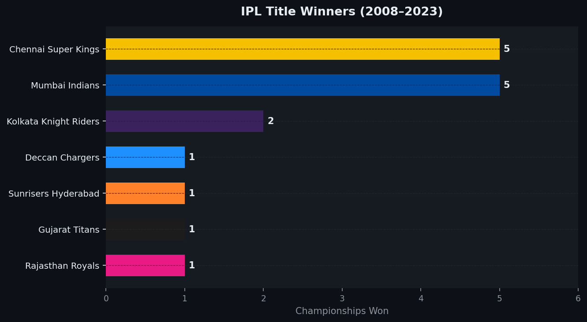
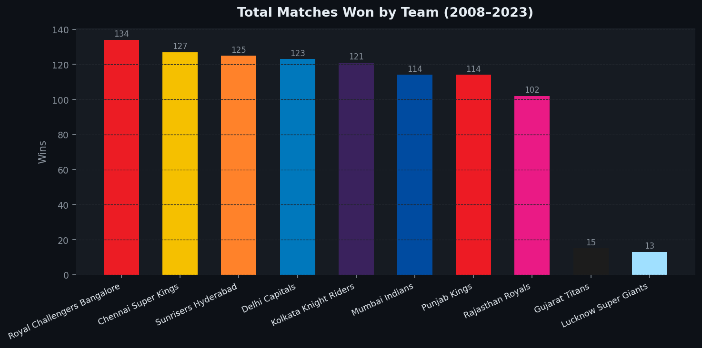
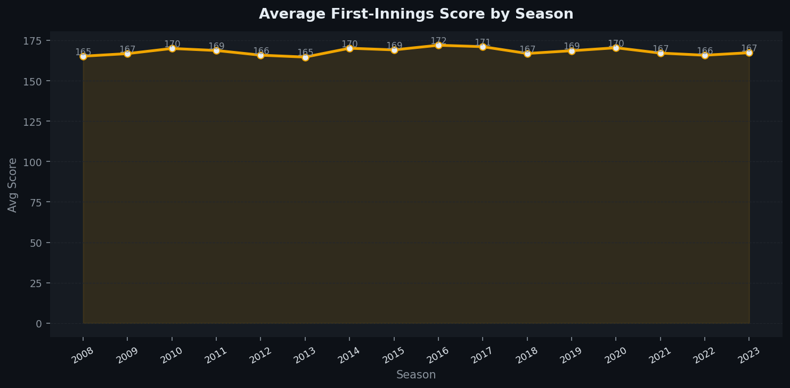
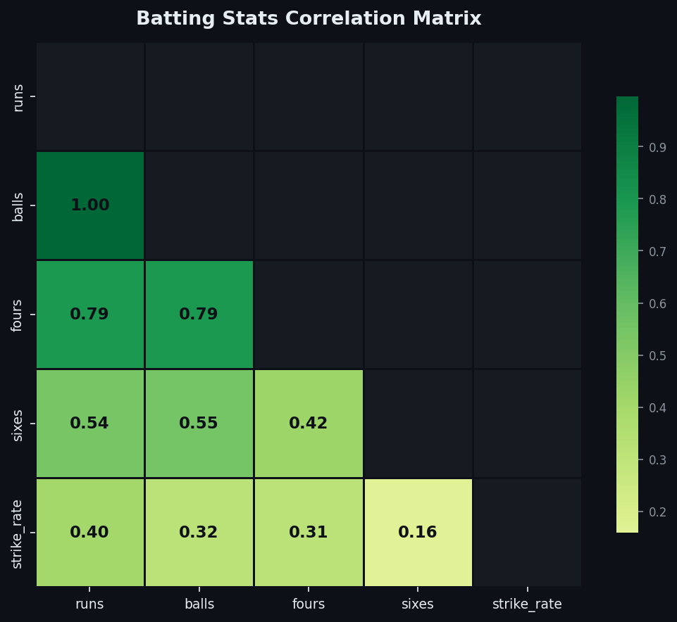
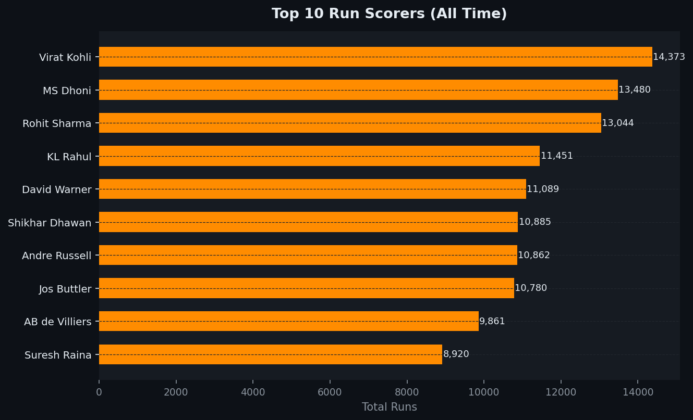
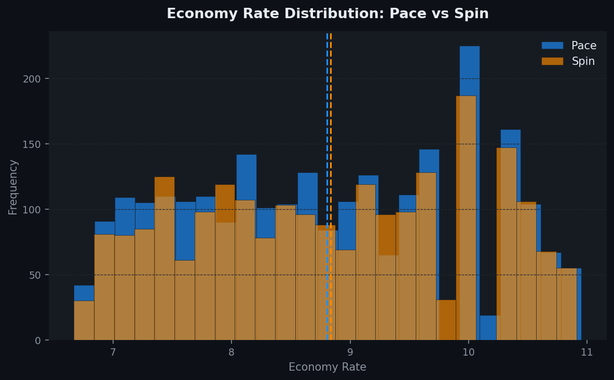

<div align="center">


</div>

<div align="center">


</div>

---

## 📌 Project Overview

This project performs a **full exploratory data analysis** on 16 seasons of IPL cricket — covering 988 matches, 5,018 batting innings, and 4,762 bowling spells across 10 franchises.

> **The core question:** *Beyond the scorecards — what patterns, trends, and insights does the data reveal about how IPL has evolved since 2008?*

The analysis covers all 4 EDA pillars: **univariate** (distributions, frequencies), **bivariate** (comparisons, relationships), **trend analysis** (season-over-season evolution), and **outlier detection** (exceptional innings, anomalous scores).

---

## 🎯 Questions Answered

| # | Question | Analysis Type |
|---|----------|---------------|
| 1 | Which teams have won the most IPL titles? | Univariate |
| 2 | How are team scores distributed — and what's the outlier threshold? | Univariate + Outliers |
| 3 | Do captains prefer to bat or field after winning the toss? | Univariate |
| 4 | Does winning the toss actually help win the match? | Bivariate |
| 5 | Who are the all-time top run scorers and wicket takers? | Univariate |
| 6 | How have average first-innings scores changed over 16 seasons? | Trend |
| 7 | Is batting strike rate rising across seasons? | Trend |
| 8 | Which batting stats are most correlated with each other? | Correlation |
| 9 | Do pace and spin bowlers have different economy rate distributions? | Bivariate |
| 10 | Who hits the most sixes in IPL history? | Univariate |
| 11 | Which innings qualify as statistical outliers (IQR method)? | Outlier Detection |

---

## 🗂️ Project Structure

```
ipl-eda/
│
├── data/
│   ├── ipl_matches.csv       ← 988 matches, 15 columns (2008–2023)
│   ├── ipl_batting.csv       ← 5,018 batting innings
│   └── ipl_bowling.csv       ← 4,762 bowling spells
│
├── notebooks/
│   └── ipl_eda.ipynb         ← Full EDA notebook (8 sections, run top-to-bottom)
│
├── charts/                   ← 12 publication-quality visualisations
│   ├── 01_title_winners.png
│   ├── 02_wins_per_team.png
│   ├── 03_toss_decision.png
│   ├── 04_avg_score_trend.png
│   ├── 05_score_distribution.png
│   ├── 06_top_batsmen.png
│   ├── 07_top_bowlers.png
│   ├── 08_strike_rate_trend.png
│   ├── 09_economy_pace_spin.png
│   ├── 10_toss_advantage.png
│   ├── 11_correlation_heatmap.png
│   └── 12_six_hitters.png
│
└── README.md
```

---

## 🗃️ Dataset Schema

### `ipl_matches.csv`
| Column | Description |
|--------|-------------|
| `match_id` | Unique match identifier |
| `season` | IPL season year (2008–2023) |
| `team1` / `team2` | Competing teams |
| `venue` | Match venue |
| `toss_winner` / `toss_decision` | Toss outcome |
| `team1_score` / `team2_score` | Final innings totals |
| `winner` | Match winner |
| `win_by_type` | Runs or Wickets |
| `win_margin` | Margin of victory |
| `player_of_match` | Award winner |

### `ipl_batting.csv`
| Column | Description |
|--------|-------------|
| `batsman` | Player name |
| `runs` / `balls` | Runs scored, balls faced |
| `fours` / `sixes` | Boundary counts |
| `strike_rate` | Runs per 100 balls |
| `batting_hand` | RHB or LHB |

### `ipl_bowling.csv`
| Column | Description |
|--------|-------------|
| `bowler` | Player name |
| `bowl_type` | Pace or Spin |
| `overs` / `runs_given` / `wickets` | Spell stats |
| `economy` | Runs per over |
| `maidens` | Maiden overs bowled |

---

## 📊 Charts Preview

## 📸 Charts Preview

<table>
  <tr>
    <td></td>
    <td></td>
  </tr>
  <tr>
    <td align="center"><sub>IPL Title Winners</sub></td>
    <td align="center"><sub>Total Wins by Team</sub></td>
  </tr>
  <tr>
    <td></td>
    <td></td>
  </tr>
  <tr>
    <td align="center"><sub>Score Inflation Over Seasons</sub></td>
    <td align="center"><sub>Batting Stats Correlation Matrix</sub></td>
  </tr>
  <tr>
    <td></td>
    <td></td>
  </tr>
  <tr>
    <td align="center"><sub>Top Run Scorers</sub></td>
    <td align="center"><sub>Pace vs Spin Economy Rates</sub></td>
  </tr>
</table>

---

## 🔍 Key Insights

### 🏆 Teams & Titles
- **CSK and MI** are the two dynasties of IPL — 5 titles each out of 16 seasons
- Mumbai Indians have the most **total match wins** across all seasons
- Teams with consistent core squads (CSK, MI) outperform teams with frequent changes

### 🎲 Toss & Strategy
- **~65% of teams choose to field** after winning the toss — chasing is the dominant strategy
- Teams that chose to field won at a **higher rate** than teams that chose to bat
- The toss advantage is real but modest — conditions and team depth matter more

### 📈 Scoring Trends
- Average first-innings scores have **risen from ~160 in 2008 to ~170+ post-2018**
- **Strike rates have increased** every year — T20 batting is evolving toward more aggression
- Q4 (high-scoring) innings above 220 runs are becoming **more frequent** since 2019

### 🎯 Batting Correlations
- **Fours have the strongest correlation with runs** (0.79) — more than sixes
- **Strike rate has only a moderate correlation** with total runs scored (0.40)
- Six-hitting and strike rate are weakly correlated (0.16) — big hitters don't always have the best SR

### 🎳 Bowling Analysis
- **Pace and spin have nearly identical average economy rates** — the type of bowling matters less than execution
- Spin bowlers show **slightly lower variance** in economy — more consistent but less explosive
- Top wicket-takers are split evenly between pace and spin

---

## 🛠️ Skills Demonstrated

| Skill | Where |
|-------|-------|
| Multi-dataset loading & merging | Section 1 |
| Descriptive stats (mean, median, std, IQR) | Sections 2, 7 |
| Univariate charts (histograms, bar, pie) | Sections 3, 5 |
| Bivariate analysis (grouped comparisons) | Section 4 |
| Time-series trend analysis | Section 5 |
| Correlation matrix with seaborn heatmap | Section 6 |
| IQR-based outlier detection | Section 7 |
| Custom IPL colour theming (per-team hex colours) | All charts |

---

## 🚀 How to Run

```bash
# 1. Clone the repo
git clone https://github.com/DheerajKandpal/ipl-eda.git
cd ipl-eda

# 2. Install dependencies
pip install pandas numpy matplotlib seaborn jupyter

# 3. Launch the notebook
jupyter notebook notebooks/ipl_eda.ipynb

# 4. Run all cells — Kernel → Restart & Run All
```

> All charts are auto-saved to `charts/` when you run the notebook.

---

## 📬 Connect

<div align="center">

[](https://linkedin.com/in/dheerajkandpal)
[](https://github.com/DheerajKandpal)
[](mailto:dheeraj.kandpal@surepass.io)

</div>

---

<div align="center">

<sub>🏏 Built with Python · 16 seasons · 988 matches · 12 visualisations · Fully reproducible</sub>
</div>
